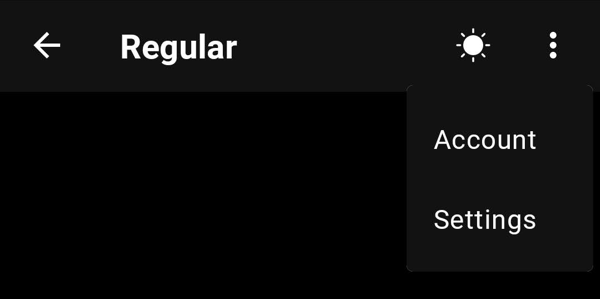

---

**Page Summary**

* [Specifications references](#specifications-references)
* [Accessibility](#accessibility)
* [Variants](#variants)
    * [Regular top app bar](#regular-top-app-bar)
    * [Large top app bar](#large-top-app-bar)
* [Extras](#extras)
    * [Overflow menu](#overflow-menu)
* [Component specific tokens](#component-specific-tokens)

---

## Specifications references

- [Design System Manager - App bars](https://system.design.orange.com/0c1af118d/p/23e0e6-app-bars/b/620966)
- [Material Design - App bars: top](https://material.io/components/app-bars-top/)
- Technical documentation soon available

## Accessibility

Please follow [accessibility criteria for development](https://a11y-guidelines.orange.com/en/mobile/android/development/)

Android's top app bar component APIs provide support for the navigation icon,
action items, overflow menu and more for informing the user as to what each
action performs. While optional, their use is strongly encouraged.

**Content descriptions**

When using icons for navigation icons, action items and other elements of top
app bars, you should set a content description on them so that screen readers
like TalkBack are able to announce their purpose or action, if any.

For an overall content description of the top app bar, set an
`android:contentDescription` or use the `setContentDescription` method on the
`MaterialToolbar`.

For the navigation icon, this can be achieved via the
`app:navigationContentDescription` attribute or
`setNavigationContentDescription` method.

For action items and items within the overflow menu, the content description
needs to be set in the menu:

```xml

<menu>
    <item android:contentDescription="@string/content_description_one" />
    <item android:contentDescription="@string/content_description_two" />
</menu>
```

For images within top app bars, set an `android:contentDescription`
or use the `setContentDescription` method on the `ImageView`.

## Variants

### Regular top app bar

> **Jetpack Compose implementation**

Add `OdsTopAppBar` composable to your Scaffold topBar:

```kotlin
OdsTopAppBar(
    title = {
        Text(text = "Title")
    },
    navigationIcon = {
        Icon(
            painter = painterResource(id = R.drawable.ic_back),
            contentDescription = "content description"
        )
    },
    onNavigationIconClick = {
        // Do something
    },
    actions = {
        OdsTopAppBarActionButton(
            onClick = { },
            painter = painterResource(id = R.drawable.ic_share),
            contentDescription = "content description"
        ) // Each action should be an `OdsTopAppBarActionButton`. They are displayed in a `Row`, so icons inside will be placed horizontally.
    }
)
```

Note: By default, the `OdsTopAppBar` is elevated but you can set `elevated` parameter to `false` if you don't want any shadow below it (for example if you want to display tabs below).

> **XML implementation**

API and source code:

* `CoordinatorLayout`: [Class definition](https://developer.android.com/reference/androidx/coordinatorlayout/widget/CoordinatorLayout)
* `AppBarLayout`: [Class definition](https://developer.android.com/reference/com/google/android/material/appbar/AppBarLayout), [Class source](https://github.com/material-components/material-components-android/tree/master/lib/java/com/google/android/material/appbar/AppBarLayout.java)
* `MaterialToolbar`: [Class definition](https://developer.android.com/reference/com/google/android/material/appbar/MaterialToolbar), [Class source](https://github.com/material-components/material-components-android/tree/master/lib/java/com/google/android/material/appbar/MaterialToolbar.java)
* `CollapsingToolbarLayout`: [Class definition](https://developer.android.com/reference/com/google/android/material/appbar/CollapsingToolbarLayout), [Class source](https://github.com/material-components/material-components-android/tree/master/lib/java/com/google/android/material/appbar/CollapsingToolbarLayout.java)

In the layout:

```xml

<androidx.coordinatorlayout.widget.CoordinatorLayout android:layout_width="match_parent"
    android:layout_height="match_parent">

    <com.google.android.material.appbar.AppBarLayout android:layout_width="match_parent"
        android:layout_height="wrap_content">

        <com.google.android.material.appbar.MaterialToolbar android:id="@+id/topAppBar"
            android:layout_width="match_parent" android:layout_height="?attr/actionBarSize"
            app:title="@string/page_title" app:menu="@menu/top_app_bar"
            app:navigationIcon="@drawable/ic_menu_24dp" />

    </com.google.android.material.appbar.AppBarLayout>

    <!-- Note: A RecyclerView can also be used -->
    <androidx.core.widget.NestedScrollView android:layout_width="match_parent"
        android:layout_height="match_parent"
        app:layout_behavior="@string/appbar_scrolling_view_behavior">

        <!-- Scrollable content -->

    </androidx.core.widget.NestedScrollView>

</androidx.coordinatorlayout.widget.CoordinatorLayout>
```

In `@menu/top_app_bar.xml`:

```xml

<menu xmlns:android="http://schemas.android.com/apk/res/android"
    xmlns:app="http://schemas.android.com/apk/res-auto">

    <item android:id="@+id/favorite" android:icon="@drawable/ic_favorite_24dp"
        android:title="@string/favorite"
        android:contentDescription="@string/content_description_favorite"
        app:showAsAction="ifRoom" />

    <item android:id="@+id/search" android:icon="@drawable/ic_search_24dp"
        android:title="@string/search"
        android:contentDescription="@string/content_description_search" app:showAsAction="ifRoom" />

    <item android:id="@+id/more" android:title="@string/more"
        android:contentDescription="@string/content_description_more" app:showAsAction="never" />

</menu>
```

In menu/navigation icons:

```xml

<vector android:tint="?attr/colorControlNormal"></vector>
```

In code:

```kotlin
topAppBar.setNavigationOnClickListener {
    // Handle navigation icon press
}

topAppBar.setOnMenuItemClickListener { menuItem ->
    when (menuItem.itemId) {
        R.id.favorite -> {
            // Handle favorite icon press
            true
        }
        R.id.search -> {
            // Handle search icon press
            true
        }
        R.id.more -> {
            // Handle more item (inside overflow menu) press
            true
        }
        else -> false
    }
}
```

_**Applying scrolling behavior to the top app bar**_

The following example shows the top app bar positioned at the same elevation as
content. Upon scroll, it increases elevation and lets content scroll behind it.

In the layout:

```xml

<androidx.coordinatorlayout.widget.CoordinatorLayout>

    <com.google.android.material.appbar.AppBarLayout app:liftOnScroll="true">

        <com.google.android.material.appbar.MaterialToolbar />

    </com.google.android.material.appbar.AppBarLayout>

</androidx.coordinatorlayout.widget.CoordinatorLayout>
```

_**Raised top app bar**_

If you need to have a top app bar with some elevation you can set the `@style/Widget.Orange.Toolbar.Raised`

```xml

<androidx.coordinatorlayout.widget.CoordinatorLayout>

    <com.google.android.material.appbar.AppBarLayout>

        <com.google.android.material.appbar.MaterialToolbar
            style="@style/Widget.Orange.Toolbar.Raised" />

    </com.google.android.material.appbar.AppBarLayout>

</androidx.coordinatorlayout.widget.CoordinatorLayout>
```

### Large top app bar

> **Jetpack Compose implementation**

First, you have to add this line in your application `build.gradle.kts` file cause this component relies on Compose Material 3 implementation:

```kotlin
implementation("androidx.compose.material3:material3:<version number>")
```

Then you can add `OdsLargeTopAppBar` composable to your Scaffold topBar:

```kotlin
OdsLargeTopAppBar(
    title = {
        Text(text = "Title")
    },
    navigationIcon = {
        Icon(
            painter = painterResource(id = R.drawable.ic_back),
            contentDescription = "content description"
        )
    },
    onNavigationIconClick = {
        // Do something
    },
    actions = {
        OdsTopAppBarActionButton(
            onClick = { },
            painter = painterResource(id = R.drawable.ic_share),
            contentDescription = "content description"
        ) // Each action should be an `OdsTopAppBarActionButton`. They are displayed in a `Row`, so icons inside will be placed horizontally.
    },
    scrollBehavior = null // See below to attach a scroll behavior and make the top app bar collapsible
)
```

If you want a collapsible large top app bar, you can follow these steps:

1 - Define the scroll behavior to use:

```kotlin
val scrollBehavior = TopAppBarDefaults.exitUntilCollapsedScrollBehavior(rememberTopAppBarState())
```

2 - Provide this `scrollBehavior` to the `OdsLargeTopAppBar` and as a modifier of your Scaffold in order to listen to the scroll event

```kotlin
Scaffold(
    modifier = Modifier.nestedScroll(scrollBehavior.nestedScrollConnection),
    topBar = {
        OdsLargeTopAppBar(
            //...
            scrollBehavior = scrollBehavior,
        )
    },
    //...
) {
    // Scaffold content
}
```

## Extras

### Overflow menu

  


You can easily add an overflow menu to your top app bar by using the `OdsTopAppBarOverflowMenuBox` composable as follow:

```kotlin
OdsTopAppBarOverflowMenuBox(overflowIconContentDescription = "more actions") {
    OdsDropdownMenuItem(
        text = "account",
        onClick = {
            // Do something
        }
    )
    OdsDropdownMenuItem(
        text = "settings",
        onClick = {
            // Do something
        }
    )
}
```

## Component specific tokens

_Soon available_
