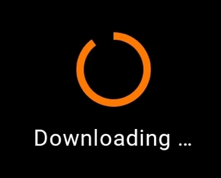

<br>**On this page**

* [Specifications references](#specifications-references)
* [Accessibility](#accessibility)
* [Variants](#variants)
    * [Progress bar](#progress-bar)
        * [Jetpack Compose](#jetpack-compose)
            * [OdsLinearProgressIndicator API](#odslinearprogressindicator-api)
    * [Activity indicator](#activity-indicator)
        * [Jetpack Compose](#jetpack-compose-1)
            * [OdsCircularProgressIndicator API](#odscircularprogressindicator-api)

---

## Specifications references

- [Design System Manager - Progress indicators](https://system.design.orange.com/0c1af118d/p/92aec5-progress-indicators------/b/33faf7)
- [Material Design - Progress indicators](https://material.io/components/progress-indicators/)

## Accessibility

Please follow [accessibility criteria for development](https://a11y-guidelines.orange.com/en/mobile/android/development/).

## Variants

### Progress bar

Progress bars, also called linear progress indicators, display progress by animating an indicator along the length of a fixed,
visible track. The behavior of the indicator is dependent on whether the progress of a process is
known.

Linear progress indicators support both determinate and indeterminate operations.

* Determinate operations display the indicator increasing in width
  from 0 to 100% of the track, in sync with the process’s progress.
* Indeterminate operations display the indicator continually growing
  and shrinking along the track until the process is complete.

  

  

#### Jetpack Compose

You can use the composable `OdsLinearProgressIndicator` like this:

For a **determinate** linear progress indicator, provide the progress value:

```kotlin
OdsLinearProgressIndicator(
    progress = 0.9f,
    label = "Downloading ...",
    icon = OdsLinearProgressIndicator(
        painterResource(id = R.drawable.ic_arrow_down),
        ""
    ),
    showCurrentValue = true
)
```

For an **indeterminate** linear progress indicator, no need to provide a progress value:

```kotlin
OdsLinearProgressIndicator(
    label = "Downloading ...",
    icon = OdsLinearProgressIndicator(
        painterResource(id = R.drawable.ic_arrow_down),
        ""
    )
)
```

##### OdsLinearProgressIndicator API

Parameter | Default&nbsp;value | Description
-- | -- | --
`modifier: Modifier` | `Modifier` | `Modifier` applied to the progress indicator
`progress: Float?` | `null` | Progress indicator value where 0.0 represents no progress and 1.0 represents full progress. Values outside of this range are coerced into the range. If set to `null`, the progress indicator is indeterminate.
`label: String?` | `null` | Label displayed above the linear progress
`icon: OdsLinearProgressIndicatorIcon?` | `null` | Icon displayed above the progress indicator
`showCurrentValue: Boolean` | `false` | Controls the progress indicator current value visibility which is displayed in percent below the progress bar
{:.table}

### Activity indicator

Activity indicators, also called circular progress indicators, display progress by animating an indicator along an
invisible circular track in a clockwise direction. They can be applied directly
to a surface, such as a button or card.

Circular progress indicators support both determinate and indeterminate
processes.

* Determinate circular indicators fill the invisible, circular track with
  color, as the indicator moves from 0 to 360 degrees.
* Indeterminate circular indicators grow and shrink in size while moving along
  the invisible track.

  

#### Jetpack Compose

You can use the `OdsCircularProgressIndicator` composable like this:

- For a **determinate** circular progress indicator, provide the progress value:

```kotlin
OdsCircularProgressIndicator(
    progress = 0.9f,
    label = "Downloading ..."
)
```

- For an **indeterminate** circular progress indicator, no need to provide a progress value:

```kotlin
OdsCircularProgressIndicator(
    label = "Downloading ..."
)
```

##### OdsCircularProgressIndicator API

Parameter | Default&nbsp;value | Description
-- | -- | --
`modifier: Modifier` | `Modifier` | `Modifier` applied to the progress indicator
`progress: Float?` | `null` | Progress indicator value where 0.0 represents no progress and 1.0 represents full progress. Values outside of this range are coerced into the range. If set to `null`, the progress indicator is indeterminate.
`label: String?` | `null` | Label displayed below the circular progress
{:.table}
