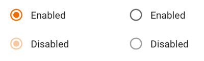
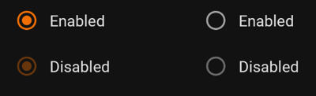

Use radio buttons to:

* Select a single option from a list
* Expose all available options
* If available options can be collapsed, consider using a dropdown menu
  instead, as it uses less space.

<br>**On this page**

* Table of contents
{:toc}

---

## Specifications references

- [Design System Manager - Selection controls](https://system.design.orange.com/0c1af118d/p/14638a-selection-controls/b/352c00)
- [Material Design - Radio buttons](https://material.io/components/radio-buttons/)

## Accessibility

Please follow [accessibility criteria for development](https://a11y-guidelines.orange.com/en/mobile/android/development/).

Radio buttons support content labeling for accessibility and are readable by
most screen readers, such as TalkBack. Text rendered in radio buttons is
automatically provided to accessibility services. Additional content labels are
usually unnecessary.

## Implementation

 

### Jetpack Compose

In your composable screen you can use:

```kotlin
OdsRadioButton(
    selected = true,
    onClick = { doSomething() },
    enabled = true
)
```

#### OdsRadioButton API

| Parameter                       | Default&nbsp;value | Description                                                                                                                                                    |
|---------------------------------|--------------------|----------------------------------------------------------------------------------------------------------------------------------------------------------------|
| <b>`selected: Boolean`</b>      |                    | Controls the selected state of the radio button                                                                                                                |
| <b>`onClick: (() -> Unit)?`</b> |                    | Callback invoked on radio button click. If `null`, then the radio button will not handle input events, and only act as a visual indicator of `selected` state. |
| `modifier: Modifier`            | `Modifier`         | `Modifier` applied to the radio button                                                                                                                         |
| `enabled: Boolean`              | `true`             | Controls the enabled state of the radio button. When `false`, the button will not be selectable and appears disabled.                                          |
