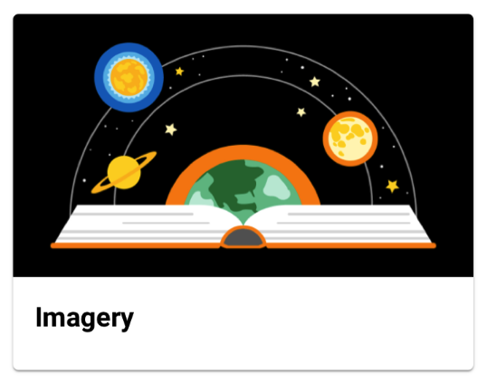
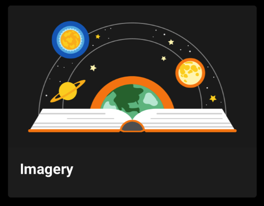
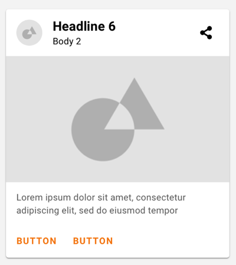
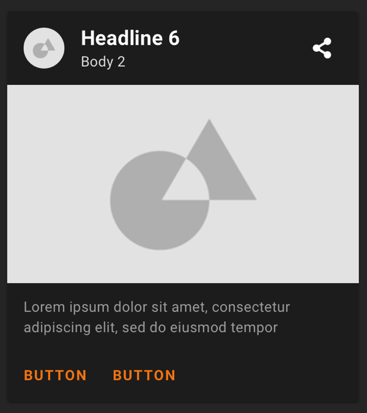
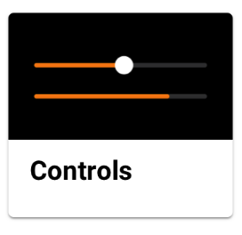
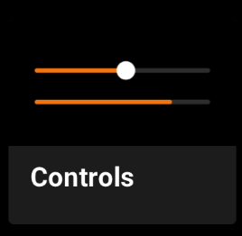

# Cards

Cards contain content and actions about a single subject.

**Contents**

*   [Using cards](#using-cards)
    *   [Material Design](#material-design)
    *   [Accessibility](#accessibility)
*   [Adding a Card](#adding-a-card)
    *   [In XML](#in-xml)
    *   [In JetPack Compose](#in-jetpack-compose)
        *   [Card image first: OdsCardImageFirst](#card-image-first-odscardimagefirst)
        *   [Card title first: OdsCardTitleFirst](#card-title-first-odscardtitlefirst)
        *   [Small card: OdsCardSmall](#small-card-odscardsmall)

## Using cards

Before you can use Orange themed cards, you need to add a dependency to the Orange Design System
for Android library. For more information, go to the
[Getting started](../getting-started.md) page.

### Material Design

Orange Cards are based on Material Design from Google and apply Orange theming.
**Note:** Here is the full documentation
of [Material Design Card](https://material.io/components/cards/)

### Accessibility

The contents within a card should follow their own accessibility guidelines,
such as images having content descriptions set on them.

If you have a draggable card, you should set an
[`AccessibilityDelegate`](https://developer.android.com/reference/android/view/View.AccessibilityDelegate)
on it, so that the behavior can be accessible via screen readers such as
TalkBack. See the [draggable card section](https://material.io/components/cards/android#making-a-card-draggable) section
below for more info.

## Adding a Card

### In XML

To have a Card in your layout you must add `com.google.android.material.card.MaterialCardView` in your layout.

API and source code:

*   `MaterialCardView`
      *   [Class definition](https://developer.android.com/reference/com/google/android/material/card/MaterialCardView)
      *   [Class source](https://github.com/material-components/material-components-android/tree/master/lib/java/com/google/android/material/card/MaterialCardView.java)

In the layout:

```xml
<com.google.android.material.card.MaterialCardView
    android:id="@+id/card"
    android:layout_width="match_parent"
    android:layout_height="wrap_content"
    android:layout_margin="8dp">

    <LinearLayout
        android:layout_width="match_parent"
        android:layout_height="wrap_content"
        android:orientation="vertical">

        <!-- Media -->
        <ImageView
            android:layout_width="match_parent"
            android:layout_height="194dp"
            app:srcCompat="@drawable/media"
            android:scaleType="centerCrop"
            android:contentDescription="@string/content_description_media"
            />

        <LinearLayout
            android:layout_width="match_parent"
            android:layout_height="wrap_content"
            android:orientation="vertical"
            android:padding="16dp">

            <!-- Title, secondary and supporting text -->
            <TextView
                android:layout_width="wrap_content"
                android:layout_height="wrap_content"
                android:text="@string/title"
                android:textAppearance="?attr/textAppearanceHeadline6"
                />
            <TextView
                android:layout_width="wrap_content"
                android:layout_height="wrap_content"
                android:layout_marginTop="8dp"
                android:text="@string/secondary_text"
                android:textAppearance="?attr/textAppearanceBody2"
                android:textColor="?android:attr/textColorSecondary"
                />
            <TextView
                android:layout_width="wrap_content"
                android:layout_height="wrap_content"
                android:layout_marginTop="16dp"
                android:text="@string/supporting_text"
                android:textAppearance="?attr/textAppearanceBody2"
                android:textColor="?android:attr/textColorSecondary"
                />

        </LinearLayout>

        <!-- Buttons -->
        <LinearLayout
            android:layout_width="wrap_content"
            android:layout_height="wrap_content"
            android:layout_margin="8dp"
            android:orientation="horizontal">
            <com.google.android.material.button.MaterialButton
                android:layout_width="wrap_content"
                android:layout_height="wrap_content"
                android:layout_marginEnd="8dp"
                android:text="@string/action_1"
                style="@style/Widget.Orange.Button.Text"
                />
            <com.google.android.material.button.MaterialButton
                android:layout_width="wrap_content"
                android:layout_height="wrap_content"
                android:text="@string/action_2"
                style="@style/Widget.Orange.Button.Text"
                />
        </LinearLayout>

    </LinearLayout>

</com.google.android.material.card.MaterialCardView>
```

### In JetPack Compose

The library offers several Composables for each type of card available in Orange Design System:

#### Card image first: OdsCardImageFirst

This is a full width card displaying with an image as first element.

   

In your composable screen you can use:

```kotlin
OdsCardImageFirst(
            title = "Title",
            imageRes = R.drawable.picture,
            imageContentDescription = "Picture content description", //Optional
            subtitle = "Subtitle", //Optional
            text = "Text", //Optional
            button1Text = "Button1", //Optional
            button2Text = "Button2", //Optional
            onCardClick = {  }, //Optional
            onButton1Click = {  }, //Optional
            onButton2Click = {  } //Optional
        )
```

#### Card title first: OdsCardTitleFirst

This is a full width card displaying with a title and a thumbnail on top as first element.

   

In your composable screen you can use:

```kotlin
OdsCardTitleFirst(
    thumbnailRes = R.drawable.thumbnail, //Optional
    title = "Title",
    subtitle = "Subtitle", //Optional
    imageRes = R.drawable.picture,
    imageContentDescription = "Picture content description", //Optional
    text = "Text", //Optional
    button1Text = "Button1", //Optional
    button2Text = "Button2", //Optional
    onCardClick = {  }, //Optional
    onButton1Click = {  }, //Optional
    onButton2Click = {  } //Optional
)
```

#### Small card: OdsCardSmall

This is a small card which takes the half screen width.

   

You can add in your compose screen the following to add a small Card:

```kotlin
Row(
    horizontalArrangement = Arrangement.spacedBy(16.dp),
) {
    OdsCardSmall(
        modifier = Modifier.weight(0.5f),
        title = "Title",
        imageRes = R.drawable.picture,
        onCardClick = {}
    )
    OdsCardSmall(
        modifier = Modifier.weight(0.5f),
        title = "Title",
        imageRes = R.drawable.picture,
        onCardClick = {}
    )
}
```