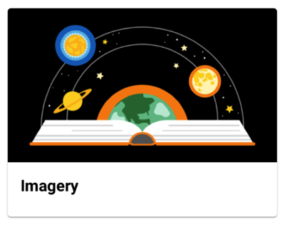
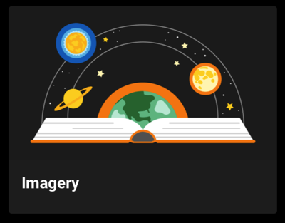

<br>**On this page**

* [Specifications references](#specifications-references)
* [Accessibility](#accessibility)
* [Variants](#variants)
    * [Vertical image first card](#vertical-image-first-card)
    * [Vertical header first card](#vertical-header-first-card)
    * [Small card](#small-card)
    * [Horizontal card](#horizontal-card)
* [Component specific tokens](#component-specific-tokens)

---

## Specifications references

- [Design System Manager - Cards](https://system.design.orange.com/0c1af118d/p/272739-cards/b/991690)
- [Material Design - Cards](https://material.io/components/cards/)

## Accessibility

Please follow [accessibility criteria for development](https://a11y-guidelines.orange.com/en/mobile/android/development/)

The contents within a card should follow their own accessibility guidelines, such as images having content descriptions set on them.
The ODS library cards APIs forces the developers to add content descriptions on card images.

## Variants

The library offers several Composables for Jetpack Compose implementation.

### Vertical image first card

This is a full width card containing elements arranged vertically with an image as first element.

 

#### Jetpack Compose implementation

In your composable screen you can use `OdsVerticalImageFirstCard` composable:

```kotlin
OdsVerticalImageFirstCard(
    title = "Title",
    image = OdsCardImage(
        painterResource(R.drawable.picture),
        "Picture content description",
        Alignment.Center,
        ContentScale.Crop,
        Color(0xff1b1b1b)
    ),
    subtitle = "Subtitle",
    text = "Text",
    firstButton = OdsCardButton("First button") { doSomething() },
    secondButton = OdsCardButton("Second button") { doSomething() },
    onClick = { doSomething() }
)
```

##### OdsVerticalImageFirstCard API

Parameter | Default&nbsp;value | Description
-- | -- | --
`title: String` | | Title displayed into the card
`image: OdsCardImage` | | Image displayed into the card
`modifier: Modifier` | `Modifier` | `Modifier` applied to the layout of the card
`subtitle: String?` | `null` | Subtitle displayed into the card
`text: String?` | `null` | Text displayed into the card
`firstButton: OdsCardButton?` | `null` | First button displayed into the card
`secondButton: OdsCardButton?` | `null` | Second button displayed into the card
`onClick: (() -> Unit)?` | `null` | Callback invoked on card click
{:.table}

#### XML implementation

_Soon available_

### Vertical header first card

This is a full width card containing elements arranged vertically with a header (thumbnail, title & subtitle) as first element.

 

#### Jetpack Compose implementation

In your composable screen you can use `OdsVerticalHeaderFirstCard` composable:

```kotlin
OdsVerticalHeaderFirstCard(
    title = "Title",
    image = OdsCardImage(
        painterResource(R.drawable.picture),
        "Picture content description",
        Alignment.Center,
        ContentScale.Crop,
        Color(0xff1b1b1b)
    ),
    thumbnail = OdsCardThumbnail(
        painterResource(R.drawable.thumbnail),
        "Thumbnail content description"
    ),
    subtitle = "Subtitle",
    text = "Text",
    firstButton = OdsCardButton("First button") { doSomething() },
    secondButton = OdsCardButton("Second button") { doSomething() },
    onClick = { doSomething() }
)
```

##### OdsVerticalHeaderFirstCard API

Parameter | Default&nbsp;value | Description
-- | -- | --
`title: String` | | Title displayed into the card
`image: OdsCardImage` | | Image displayed into the card
`modifier: Modifier` | `Modifier` | `Modifier` applied to the layout of the card
`thumbnail: OdsCardThumbnail?` | `null` | Thumbnail displayed into the card next to the title: avatar, logo or icon.
`subtitle: String?` | `null` | Subtitle displayed into the card
`text: String?` | `null` | Text displayed into the card
`firstButton: OdsCardButton?` | `null` | First button displayed into the card
`secondButton: OdsCardButton?` | `null` | Second button displayed into the card
`onClick: (() -> Unit)?` | `null` | Callback called on card click
{:.table}

#### XML implementation

_Soon available_

### Small card

This is a small card which takes the half screen width.

 

#### Jetpack Compose implementation

You can add an `OdsSmallCard` composable in your screen to add a small card:

```kotlin
Row(
    horizontalArrangement = Arrangement.spacedBy(16.dp),
) {
    OdsSmallCard(
        title = "Title",
        image = OdsCardImage(
            painterResource(R.drawable.picture),
            "Picture content description"
        ),
        modifier = Modifier.weight(0.5f),
        onClick = { doSomething() }
    )
    OdsSmallCard(
        title = "Title",
        image = OdsCardImage(
            painterResource(R.drawable.picture),
            "Picture content description"
        ),
        modifier = Modifier.weight(0.5f),
        onClick = { doSomething() }
    )
}
```

##### OdsSmallCard API

Parameter | Default&nbsp;value | Description
-- | -- | --
`title: String` | | Title displayed into the card
`image: OdsCardImage` | | Image displayed into the card
`modifier: Modifier` | `Modifier` | `Modifier` applied to the layout of the card
`subtitle: String?` | `null` | Subtitle displayed into the card
`onClick: (() -> Unit)?` | `null` | Callback invoked on card click
{:.table}

#### XML implementation

_Soon available_

### Horizontal card

This is a full screen width card with an image on the side. The image can be displayed on the left or on the right.

 

#### Jetpack Compose implementation

In your screen you can use `OdsHorizontalCard` composable:

```kotlin
OdsHorizontalCard(
    title = "Title",
    image = OdsCardImage(
        painterResource(R.drawable.picture),
        "Picture content description",
        Alignment.Center,
        ContentScale.Crop,
        Color(0xff1b1b1b)
    ),
    subtitle = "Subtitle",
    text = "Text",
    firstButton = OdsCardButton("First button") { doSomething() },
    secondButton = OdsCardButton("Second button") { doSomething() },
    imagePosition = OdsHorizontalCardImagePosition.Start,
    divider = false,
    onClick = { doSomething() }
)
```

##### OdsHorizontalCard API

Parameter | Default&nbsp;value | Description
-- | -- | --
`title: String` | | Title displayed into the card
`image: OdsCardImage` | | Image displayed into the card
`modifier: Modifier` | `Modifier` | `Modifier` applied to the layout of the card
`subtitle: String?` | `null` | Subtitle displayed into the card
`text: String?` | `null` | Text displayed into the card
`firstButton: OdsCardButton?` | `null` | First button displayed into the card
`secondButton: OdsCardButton?` | `null` | Second button displayed into the card
`imagePosition: OdsHorizontalCardImagePosition` | `OdsHorizontalCardImagePosition.Start` | Position of the image within the card, it can be set to `OdsHorizontalCardImagePosition.Start` or `OdsHorizontalCardImagePosition.End`
`divider: Boolean` | `true` | Controls the divider display. If `true`, it will be displayed between the card content and the action buttons.
`onClick: (() -> Unit)?` | `null` | Callback invoked on card click
{:.table}

#### XML implementation

_Soon available_

## Component specific tokens

_Soon available_
