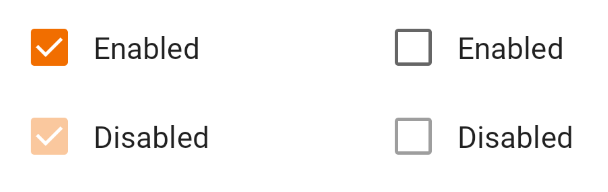
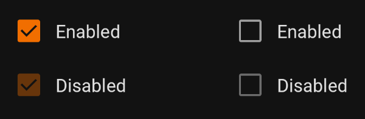

Use checkboxes to:

* Select one or more options from a list
* Present a list containing sub-selections
* Turn an item on or off in a desktop environment

<br>**On this page**

* [Specifications references](#specifications-references)
* [Accessibility](#accessibility)
* [Implementation](#implementation)
    * [Jetpack Compose](#jetpack-compose)
        * [OdsCheckbox API](#odscheckbox-api)

---

## Specifications references

- [Design System Manager - Selection controls](https://system.design.orange.com/0c1af118d/p/14638a-selection-controls/b/352c00)
- [Material Design - Checkboxes](https://material.io/components/checkboxes/)

## Accessibility

Please follow [accessibility criteria for development](https://a11y-guidelines.orange.com/en/mobile/android/development/).

Checkboxes support content labeling for accessibility and are readable by most screen readers, such
as TalkBack. Text rendered in check boxes is automatically provided to accessibility services.
Additional content labels are usually unnecessary.

## Implementation

 

### Jetpack Compose

In your composable screen you can use:

```kotlin
var checked by remember { mutableStateOf(false) }
OdsCheckbox(
    checked = checked,
    onCheckedChange = { checked = it },
    enabled = true
)
```

#### OdsCheckbox API

{:.table}

| Parameter                                      | Default&nbsp;value | Description                                                                                                                                       |
|------------------------------------------------|--------------------|---------------------------------------------------------------------------------------------------------------------------------------------------|
| <b>`checked: Boolean`</b>                      |                    | Controls checked state of the checkbox                                                                                                            |
| <b>`onCheckedChange: ((Boolean) -> Unit)?`</b> |                    | Callback invoked on checkbox click. If `null`, then this is passive and relies entirely on a higher-level component to control the checked state. |
| `modifier: Modifier`                           | `Modifier`         | `Modifier` applied to the checkbox                                                                                                                |
| `enabled: Boolean`                             | `true`             | Controls enabled state of the checkbox. When `false`, this checkbox will not be clickable.                                                        |
