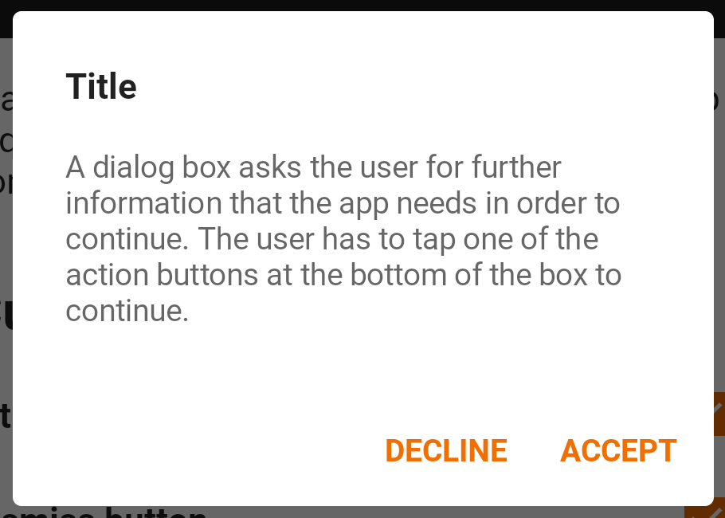
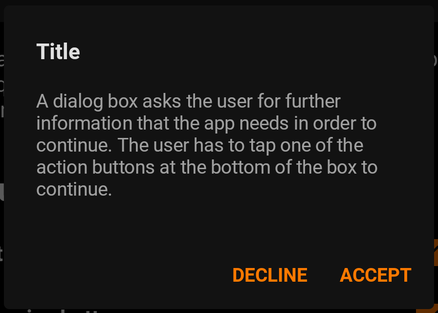

A dialog is a type of modal window that appears in front of app content to
provide critical information or ask for a decision. Dialogs disable all app
functionality when they appear, and remain on screen until confirmed, dismissed,
or a required action has been taken.

Dialogs are purposefully interruptive, so they should be used sparingly.

<br>**On this page**

* [Specifications references](#specifications-references)
* [Accessibility](#accessibility)
* [Variants](#variants)
    * [Alert dialog](#alert-dialog)
        * [Jetpack Compose](#jetpack-compose)
            * [OdsAlertDialog API](#odsalertdialog-api)

---

## Specifications references

- [Design System Manager - Dialogs](https://system.design.orange.com/0c1af118d/p/02ae02-dialogs/b/81772e)
- [Material Design - Dialogs](https://material.io/components/dialogs)

## Accessibility

Please follow [accessibility criteria for development](https://a11y-guidelines.orange.com/en/mobile/android/development/).

## Variants

### Alert dialog

Alert dialogs interrupt users with urgent information, details, or actions.

  

#### Jetpack Compose

To display an alert dialog in your composable screen, you can use:

```kotlin
OdsAlertDialog(
    modifier = Modifier,
    title = "title",
    text = "content text of the dialog",
    confirmButton = OdsAlertDialogButtonBuilder("confirm") { doSomething() },
    dismissButton = OdsAlertDialogButtonBuilder("dismiss") { doSomething() },
    properties = DialogProperties()
)
```

##### OdsAlertDialog API

Parameter | Default&nbsp;value | Description
-- | -- | --
`text: String` | | Text displayed into the dialog which presents the details regarding the Dialog's purpose
`confirmButton: OdsAlertDialogButtonBuilder` | | Button displayed into the dialog which is meant to confirm a proposed action, thus resolving what triggered the dialog
`modifier: Modifier` | `Modifier` | `Modifier` applied to the layout of the dialog
`onDismissRequest: () -> Unit` | `{}` | Callback invoked when the user tries to dismiss the dialog by clicking outside or pressing the back button. This is not called when the dismiss button is clicked.
`dismissButton: OdsAlertDialogButtonBuilder?` | `null` | Button displayed into the dialog which is meant to dismiss the dialog
`title: String?` | `null` | Title displayed into the dialog which should specify the purpose of the dialog. The title is not mandatory, because there may be sufficient information inside the `text`.
`properties: DialogProperties` | `DialogProperties()` | Typically platform specific properties to further configure the dialog
{:.table}
