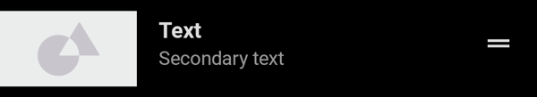

<br>**On this page**

* [Specifications references](#specifications-references)
* [Accessibility](#accessibility)
* [Variants](#variants)
    * [Single-line list](#single-line-list)
        * [Jetpack Compose](#jetpack-compose)
            * [OdsListItem API](#odslistitem-api)
    * [Two-line list](#two-line-list)
        * [Jetpack Compose](#jetpack-compose-1)
    * [Three-line list](#three-line-list)
        * [Jetpack Compose](#jetpack-compose-2)

---

## Specifications references

- [Design System Manager - Lists](https://system.design.orange.com/0c1af118d/p/09a804-lists/b/669743)
- [Material Design - Lists](https://material.io/components/lists/)

## Accessibility

Please follow [accessibility criteria for development](https://a11y-guidelines.orange.com/en/mobile/android/development/).

## Variants

### Single-line list

There are multiple display possibilities for a single-line list, where leading can optionally be an icon, a circular, a square or a wide image.

Here are two examples:

- with a wide image and a checkbox

   

- with a standard icon and a checkbox

   

Please note that there is no start padding with wide images.

#### Jetpack Compose

The library offers the `OdsListItem` composable to display lists items.

The `OdsListItem` composable allows you to display a leading icon using the `icon` parameter of the `OdsListItem` method, as well as a trailing element (either a checkbox, a switch, a radio button, an icon or a caption text) using the `trailing` parameter.

```kotlin
OdsListItem(
    modifier = Modifier.clickable { doSomething() },
    text = "Primary text",
    icon = OdsListItem.Icon(
        OdsListItem.Icon.Type.Icon,
        painterResource(id = R.drawable.ic_heart),
        "Heart"
    ),
    trailing = OdsListItem.TrailingCheckbox(checked) { checked != checked },
    divider = true
)
```

##### OdsListItem API

Parameter | Default&nbsp;value | Description
-- | -- | --
`text: String` | | The primary text of the list item
`modifier: Modifier` | `Modifier` | Modifier to be applied to the list item
`icon: OdsListItem.Icon?` | `null` | The leading supporting visual of the list item
`secondaryText: String?` | `null` | The secondary text of the list item
`singleLineSecondaryText: Boolean` | `true` | Whether the secondary text is single line
`overlineText: String?` | `null` | The text displayed above the primary text
`trailing: OdsListItem.Trailing?` | `null` | The trailing content to display at the end of the list item
`divider: Boolean` | `false` | Whether or not a divider is displayed at the bottom of the list item
`onClick: (() -> Unit)?` | `null` | Will be called when the user clicks the list item. This parameter only has an effect if trailing is `OdsListItem.TrailingIcon` or `null`.
{:.table}

### Two-line list

Like single-line list, two-line list leading can optionally be an icon, a circular, a square or a wide image.

Here are two examples:

- with a wide image and a checkbox

   

- with a standard icon and a checkbox

   

#### Jetpack Compose

The only difference with the single-line implementation is that the `secondaryText` property of `OdsListItem` is not null.

```kotlin
OdsListItem(
    modifier = Modifier.clickable { doSomething() },
    text = "Primary text",
    secondaryText = "Secondary text",
    icon = OdsListItem.Icon(
        OdsListItem.Icon.Type.CircularImage,
        painterResource(id = R.drawable.placeholder, "")
    ),
    trailing = OdsListItem.TrailingIcon(
        painterResource(id = R.drawable.ic_drag_handle),
        "Drag item"
    ),
    divider = true
)
```

Use [OdsListItem API](#odslistitem-api).

### Three-line list

Like single-line list, three-line list leading can optionally be an icon, a circular, a square or a wide image.

Here are two examples:

- with a wide image and a checkbox

   

- with a standard icon and a checkbox

   

#### Jetpack Compose

The only difference with the two-line implementation is that the `singleLineSecondaryText` property of `OdsListItem` is `false`.

```kotlin
OdsListItem(
    modifier = Modifier.clickable { doSomething() },
    text = "Primary text",
    secondaryText = "Lorem ipsum dolor sit amet, consectetur adipiscing elit, sed do eiusmod tempor.",
    singleLineSecondaryText = false,
    icon = OdsListItem.Icon(
        OdsListItem.Icon.Type.SquareImage,
        painter = painterResource(id = R.drawable.placeholder),
        ""
    ),
    trailing = OdsListItem.TrailingCaption("Caption"),
    divider = true
)
```

Use [OdsListItem API](#odslistitem-api).
