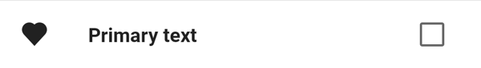
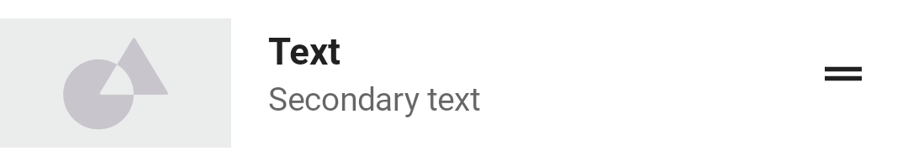
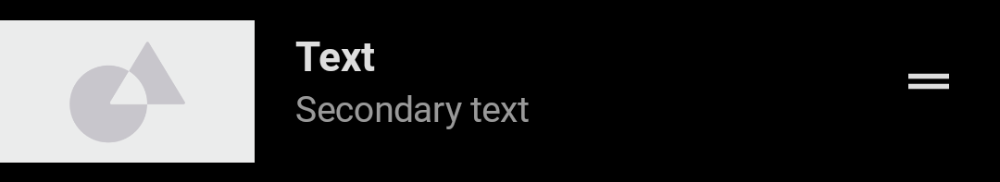
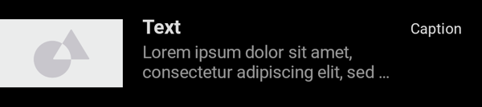

---
layout: detail
title: Lists
description: Lists description
------------------------------

# Lists

Lists are continuous, vertical indexes of text or images.

**Contents**

*   [Usage](#usage)
*   [Material Design](#material-design)
*   [Implementation with ODS library](#implementation-with-ods-library)
    *   [In XML](#in-xml)
    *   [In Jetpack Compose](#in-jetpack-compose)
        *   [OdsListItem](#odslistitem)
        *   [OdsListItemWideThumbnail](#odslistitemwidethumbnail)

## Usage

Lists are a continuous group of text or images. They are composed of items containing primary and supplemental actions, which are represented by icons and text.
Three types of items are identified:
- Single-line list items containing a maximum of one line of text
- Two-line list items containing a maximum of two lines of text
- Three-line list items containing a maximum of three lines of text

## Material Design

**Note:** Here is the full documentation of [Material Design Lists](https://material.io/components/lists/)

## Implementation with ODS library

### In XML

Not available yet

## In Jetpack Compose

The library offers 2 composables to display lists items. If you need to display a wide thumbnail without start padding in your item use [OdsListItemWideThumbnail](#odslistitemwidethumbnail).  
In all other cases use [OdsListItem](#odslistitem).

### OdsListItem

Use this composable in all cases except when you need to display a wide thumbnail in your item, otherwise see [OdsListItemWideThumbnail](#odslistitemwidethumbnail).

**One-line list**

Here is an example of one-line list item with an optional icon (here an heart Icon) and an optional trailing (here an `OdsCheckbox`).

   

```kotlin
    OdsListItem(
        modifier = Modifier.clickable { doSomething() },
        text = "Primary text",
        icon = { Icon(painter = painterResource(id = R.drawable.ic_heart), contentDescription = "Heart") },
        isThumbnailIcon = false
    )
```

**Two-line list**

Here is an example of two-line list item with an optional icon (here an `OdsImageCircleShape` provided by the library) and an optional trailing (here a drag Icon).

   

```kotlin
        OdsListItem(
            modifier = Modifier.clickable { doSomething() },
            text = "Primary text",
            secondaryText = "Secondary text",
            icon = { OdsImageCircleShape(painter = painterResource(R.drawable.placeholder)) },
            trailing = { Icon(painter = painterResource(id = R.drawable.ic_drag_handle), contentDescription = "Drag item") }
        )
```

**Three-line list**

Here is an example of three-line list item with an optional icon (here an `OdsListSquaredThumbnail` provided by the library) and an optional trailing (here a simple Text) .

   

```kotlin
        OdsListItem(
            modifier = Modifier.clickable { doSomething() },
            text = "Primary text",
            secondaryText = "Lorem ipsum dolor sit amet, consectetur adipiscing elit, sed do eiusmod tempor.",
            singleLineSecondaryText = false,
            icon = { OdsListSquaredThumbnail(painter = painterResource(R.drawable.placeholder)) },
            trailing = { Text(text = "Caption") }
        )
```

### OdsListItemWideThumbnail

Use this composable if you need to display a wide thumbnail without start padding in you item, otherwise see [OdsListItem](#odslistitem).

**One-line list**

Here is an example of one-line list item with a wide thumbnail and an optional trailing (here an `OdsCheckbox`).

   

```kotlin
        OdsListItemWideThumbnail(
            modifier = Modifier.clickable { doSomething() },
            text = "Text",
            thumbnail = painterResource(id = R.drawable.placeholder),
            trailing = { OdsCheckbox(checked = itemChecked, onCheckedChange = { itemChecked = it }) }
        )
```

#### Two-line list

Here is an example of two-line list item with a wide thumbnail and an optional trailing (here a drag Icon).

   

```kotlin
        OdsListItemWideThumbnail(
            modifier = Modifier.clickable { doSomething() },
            text = "Text",
            secondaryText = "Secondary text",
            thumbnail = painterResource(id = R.drawable.placeholder),
            trailing = { Icon(painter = painterResource(id = R.drawable.ic_drag_handle), contentDescription = "Drag item") }
        )
```

#### Three-line list

Here is an example of three-line list item with a wide thumbnail and an optional trailing (here a simple Text).

   

```kotlin
        OdsListItemWideThumbnail(
            modifier = Modifier.clickable { doSomething() },
            text = "Text",
            secondaryText = "Lorem ipsum dolor sit amet, consectetur adipiscing elit, sed do eiusmod tempor.",
            singleLineSecondaryText = false,
            thumbnail = painterResource(id = R.drawable.placeholder),
            trailing = { Text(text = "Caption") }
        )
```