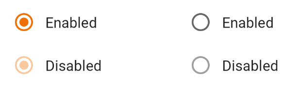
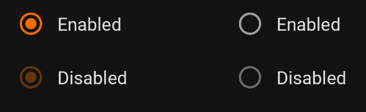

**Page Summary**

* [Specifications references](#specifications-references)
* [Accessibility](#accessibility)
* [Implementation](#implementation)
* [Component specific tokens](#component-specific-tokens)


Use radio buttons to:
*   Select a single option from a list
*   Expose all available options
*   If available options can be collapsed, consider using a dropdown menu
    instead, as it uses less space.

## Specifications references

- [Design System Manager - Selection controls](https://system.design.orange.com/0c1af118d/p/14638a-selection-controls/b/352c00)
- [Material Design - Radio buttons](https://material.io/components/radio-buttons/)
- Technical documentation soon available

## Accessibility

Please follow [accessibility criteria for development](https://a11y-guidelines.orange.com/en/mobile/android/development/)

Radio buttons support content labeling for accessibility and are readable by
most screen readers, such as TalkBack. Text rendered in radio buttons is
automatically provided to accessibility services. Additional content labels are
usually unnecessary.

## Implementation

 

> **Jetpack Compose implementation**

In your composable screen you can use:

```kotlin
OdsRadioButton(
    selected = true,
    onClick = { },
    enabled = true
)
```

> **XML implementation**

To create a Radio Button you just have to add a `RadioButton` in your layout. Orange theme will be
automatically applied.

In the layout:

```xml
<RadioButton
    android:id="@+id/radio_button"
    android:layout_width="match_parent"
    android:layout_height="match_parent"
    android:text="@string/label"/>
```

Changes in the states of one radio button can affect other buttons in the group.
Specifically, selecting a `RadioButton` in a `RadioGroup` will de-select all
other buttons in that group.

Example showing a **radio button group** with five radio buttons.

In the layout:

```xml
<RadioGroup
    android:id="@+id/radioGroup"
    android:checkedButton="@+id/radio_button_1"
    android:layout_width="match_parent"
    android:layout_height="wrap_content">
    <RadioButton
        android:id="@+id/radio_button_1"
        android:layout_width="match_parent"
        android:layout_height="match_parent"
        android:text="@string/label_1"/>
    <RadioButton
        android:id="@+id/radio_button_2"
        android:layout_width="match_parent"
        android:layout_height="match_parent"
        android:text="@string/label_2"/>
    <RadioButton
        android:id="@+id/radio_button_3"
        android:layout_width="match_parent"
        android:layout_height="match_parent"
        android:text="@string/label_3"/>
    <RadioButton
        android:id="@+id/radio_button_4"
        android:layout_width="match_parent"
        android:layout_height="match_parent"
        android:text="@string/label_4"/>
    <RadioButton
        android:id="@+id/radio_button_5"
        android:layout_width="match_parent"
        android:layout_height="match_parent"
        android:enabled="false"
        android:text="@string/label_5"/>
</RadioGroup>
```

## Component specific tokens

_Soon available_
