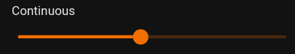
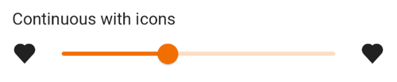
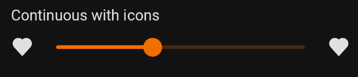
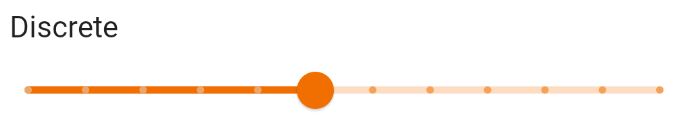
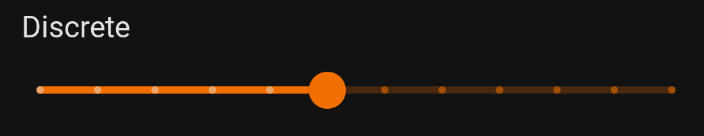
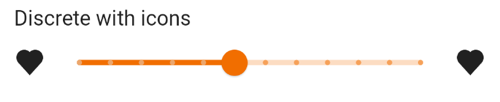
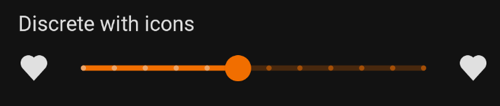

<br>**On this page**

* [Specifications references](#specifications-references)
* [Accessibility](#accessibility)
* [Variants](#variants)
    * [Continuous slider](#continuous-slider)
        * [Jetpack Compose](#jetpack-compose)
            * [OdsSlider API](#odsslider-api)
    * [Continuous lockups slider](#continuous-lockups-slider)
        * [Jetpack Compose](#jetpack-compose-1)
            * [OdsSliderLockups API](#odssliderlockups-api)
    * [Discrete slider](#discrete-slider)
        * [Jetpack Compose](#jetpack-compose-2)
    * [Discrete lockups slider](#discrete-lockups-slider)
        * [Jetpack Compose](#jetpack-compose-3)

---

## Specifications references

- [Design System Manager - Sliders](https://system.design.orange.com/0c1af118d/p/8077fc-sliders/b/673558)
- [Material Design - Sliders](https://material.io/components/sliders/)

## Accessibility

Please follow [accessibility criteria for development](https://a11y-guidelines.orange.com/en/mobile/android/development/).

## Variants

### Continuous slider

Continuous sliders allow users to make meaningful selections that don’t require
a specific value.

 

With icons:

 

#### Jetpack Compose

In your composable screen you can use:

```kotlin
OdsSlider(
    value = 20f,
    steps = 9,
    onValueChange = { doSomething() }
)
```

You can add icons to the continuous slider like this:

```kotlin
OdsSlider(
    value = 20f,
    steps = 9,
    onValueChange = { doSomething() },
    startIcon = OdsSlider.Icon(
        painterResource(id = R.drawable.ic_volume_status_1),
        stringResource(id = R.string.component_slider_low_volume)
    ),
    endIcon = OdsSlider.Icon(
        painterResource(id = R.drawable.ic_volume_status_4),
        stringResource(id = R.string.component_slider_high_volume)
    )
)
```

##### OdsSlider API

{:.table}

| Parameter                                     | Default&nbsp;value | Description                                                                                                                                                                                                                                             |
|-----------------------------------------------|--------------------|---------------------------------------------------------------------------------------------------------------------------------------------------------------------------------------------------------------------------------------------------------|
| <b>`value: Float`</b>                         |                    | Current value of the slider. If outside of `valueRange` provided, value will be coerced to this range.                                                                                                                                                  |
| <b>`onValueChange: (Float) -> Unit`</b>       |                    | Callback invoked on slider value change. `value` should be updated here.                                                                                                                                                                                |
| `modifier: Modifier`                          | `Modifier`         | `Modifier` applied to the slider                                                                                                                                                                                                                        |
| `enabled: Boolean`                            | `true`             | Controls the enabled state of the slider. If `false`, the user cannot interact with it.                                                                                                                                                                 |
| `valueRange: ClosedFloatingPointRange<Float>` | `0f..1f`           | Range of values that the slider can take. Given `value` will be coerced to this range.                                                                                                                                                                  |
| `steps: Int`                                  | `0`                | If greater than `0`, specifies the amounts of discrete values, evenly distributed between across the whole value range. If `0`, slider will behave as a continuous slider and allow to choose any value from the range specified. Must not be negative. |
| `onValueChangeFinished: (() -> Unit)?`        | `null`             | Callback invoked when value change has ended. This callback shouldn't be used to update the slider value (use `onValueChange` for that), but rather to know when the user has completed selecting a new value by ending a drag or a click.              |
| `startIcon: OdsSlider.Icon?`                  | `null`             | Icon displayed at the start of the slider                                                                                                                                                                                                               |
| `endIcon: OdsSlider.Icon?`                    | `null`             | Icon displayed at the end of the slider                                                                                                                                                                                                                 |

### Continuous lockups slider

 

With icons:

 

#### Jetpack Compose

In your composable screen you can use:

```kotlin
OdsSliderLockups(
    value = 20f,
    valueRange = 0f..100f,
    onValueChange = { doSomething() }
)
```

You can add icons to the continuous lockups slider like this:

```kotlin
OdsSliderLockups(
    value = 20f,
    valueRange = 0f..100f,
    onValueChange = { doSomething() },
    startIcon = OdsSlider.Icon(
        painterResource(id = R.drawable.ic_volume_status_1),
        stringResource(id = R.string.component_slider_low_volume)
    ),
    endIcon = OdsSlider.Icon(
        painterResource(id = R.drawable.ic_volume_status_4),
        stringResource(id = R.string.component_slider_high_volume)
    )
)
```

##### OdsSliderLockups API

{:.table}

| Parameter                                     | Default&nbsp;value | Description                                                                                                                                                                                                                                             |
|-----------------------------------------------|--------------------|---------------------------------------------------------------------------------------------------------------------------------------------------------------------------------------------------------------------------------------------------------|
| <b>`value: Float`</b>                         |                    | Current value of the slider. If outside of `valueRange` provided, value will be coerced to this range.                                                                                                                                                  |
| <b>`onValueChange: (Float) -> Unit`</b>       |                    | Callback invoked on slider value change. `value` should be updated here.                                                                                                                                                                                |
| `modifier: Modifier`                          | `Modifier`         | `Modifier` applied to the slider                                                                                                                                                                                                                        |
| `enabled: Boolean`                            | `true`             | Controls the enabled state of the slider. If `false`, the user cannot interact with it.                                                                                                                                                                 |
| `valueRange: ClosedFloatingPointRange<Float>` | `0f..1f`           | Range of values that the slider can take. Given `value` will be coerced to this range.                                                                                                                                                                  |
| `steps: Int`                                  | `0`                | If greater than `0`, specifies the amounts of discrete values, evenly distributed between across the whole value range. If `0`, slider will behave as a continuous slider and allow to choose any value from the range specified. Must not be negative. |
| `onValueChangeFinished: (() -> Unit)?`        | `null`             | Callback invoked when value change has ended. This callback shouldn't be used to update the slider value (use `onValueChange` for that), but rather to know when the user has completed selecting a new value by ending a drag or a click.              |
| `startIcon: OdsSlider.Icon?`                  | `null`             | Icon displayed at the start of the slider                                                                                                                                                                                                               |
| `endIcon: OdsSlider.Icon?`                    | `null`             | Icon displayed at the end of the slider                                                                                                                                                                                                                 |

### Discrete slider

Discrete sliders display a numeric value label upon pressing the thumb, which
allows a user to input an exact value.

 

With icons:

 

#### Jetpack Compose

In your composable screen you can use:

```kotlin
OdsSlider(
    value = 20f,
    valueRange = 0f..100f,
    steps = 10,
    onValueChange = { doSomething() }
)
```

You can add icons to the discrete slider like this:

```kotlin
OdsSlider(
    value = 20f,
    valueRange = 0f..100f,
    steps = 10,
    onValueChange = { doSomething() },
    startIcon = OdsSlider.Icon(
        painterResource(id = R.drawable.ic_volume_status_1),
        stringResource(id = R.string.component_slider_low_volume)
    ),
    endIcon = OdsSlider.Icon(
        painterResource(id = R.drawable.ic_volume_status_4),
        stringResource(id = R.string.component_slider_high_volume)
    )
)
```

Use [OdsSlider API](#odsslider-api).

### Discrete lockups slider

 

With icons:

 

#### Jetpack Compose

In your composable screen you can use:

```kotlin
OdsSliderLockups(
    value = 20f,
    valueRange = 0f..100f,
    steps = 10,
    onValueChange = { doSomething() }
)
```

You can add icons to the continuous lockups slider like this:

```kotlin
OdsSliderLockups(
    value = 20f,
    valueRange = 0f..100f,
    steps = 10,
    onValueChange = { doSomething() },
    startIcon = OdsSlider.Icon(
        painterResource(id = R.drawable.ic_volume_status_1),
        stringResource(id = R.string.component_slider_low_volume)
    ),
    endIcon = OdsSlider.Icon(
        painterResource(id = R.drawable.ic_volume_status_4),
        stringResource(id = R.string.component_slider_high_volume)
    )
)
```

Use [OdsSliderLockups API](#odssliderlockups-api).
