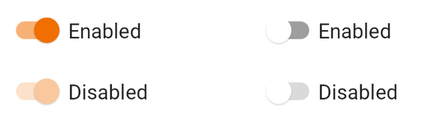
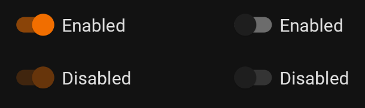

Switches toggle the state of a single setting on or off. They are the preferred
way to adjust settings on mobile.

<br>
**Page Summary**

* [Specifications references](#specifications-references)
* [Accessibility](#accessibility)
* [Implementation](#implementation)
* [Component specific tokens](#component-specific-tokens)

---

## Specifications references

- [Design System Manager - Selection controls](https://system.design.orange.com/0c1af118d/p/14638a-selection-controls/b/352c00)
- [Material Design - Switches](https://material.io/components/switches)

## Accessibility

Please follow [accessibility criteria for development](https://a11y-guidelines.orange.com/en/mobile/android/development/)

Switches support content labeling for accessibility and are readable by most
screen readers, such as TalkBack. Text rendered in switches is automatically
provided to accessibility services. Additional content labels are usually
unnecessary.

## Implementation

 

### Jetpack Compose

In your composable screen you can use:

```kotlin
OdsSwitch(
    checked = true,
    onCheckedChange = { doSomething() },
    enabled = true
)
```

#### OdsSwitch API

Parameter | Default value | Description
-- | -- | --
`checked: Boolean` | | Controls the checked state of the switch
`onCheckedChange: ((Boolean) -> Unit)?` | | Callback invoked on switch check. If `null`, then this is passive and relies entirely on a higher-level component to control the "checked" state.
`modifier: Modifier` | `Modifier` | `Modifier` applied to the switch
`enabled: Boolean` | `true` | Controls the enabled state of the switch. When `false`, the switch will not be checkable and appears disabled.
{:.table}

## Component specific tokens

_Soon available_
