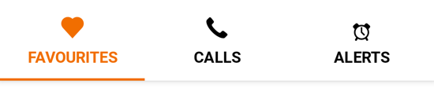
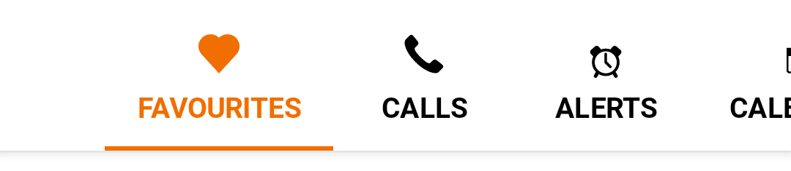
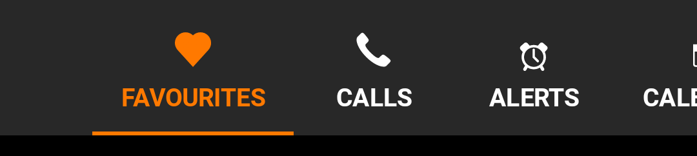

<br>**On this page**

* [Specifications references](#specifications-references)
* [Accessibility](#accessibility)
* [Variants](#variants)
    * [Fixed tabs row](#fixed-tabs-row)
        * [Jetpack Compose](#jetpack-compose)
            * [OdsTabRow API](#odstabrow-api)
    * [Scrollable tabs row](#scrollable-tabs-row)
        * [Jetpack Compose](#jetpack-compose-1)
            * [OdsScrollableTabRow API](#odsscrollabletabrow-api)

---

## Specifications references

- [Design System Manager - Tabs](https://system.design.orange.com/0c1af118d/p/513d27-tabs/b/50cb71)
- [Material Design - Tabs](https://material.io/components/tabs/)

## Accessibility

Please follow [accessibility criteria for development](https://a11y-guidelines.orange.com/en/mobile/android/development/).

The Android tab components support screen reader descriptions for tabs and
badges. While optional, we strongly encourage their use.

## Variants

### Fixed tabs row

Fixed tabs display all tabs on one screen, with each tab at a fixed width. The
width of each tab is determined by dividing the number of tabs by the screen
width. They don’t scroll to reveal more tabs; the visible tab set represents the
only tabs available.

#### Jetpack Compose

To display fixed tabs, use `OdsTabRow` composable and provide a list of `OdsTabRow.Tab` representing the tabs to display.  
You can change tab icon position with `tabIconPosition` parameter.




```kotlin
OdsTabRow(
    selectedTabIndex = 0,
    tabs = listOf(
        OdsTabRow.Tab(
            painter = OdsTabRow.Tab.Icon(painterResource(id = R.drawable.ic_heart)),
            text = "Favourites",
            onClick = { doSomething() }
        ),
        OdsTabRow.Tab(
            painter = OdsTabRow.Tab.Icon(painterResource(id = R.drawable.ic_call)),
            text = "Calls",
            onClick = { doSomething() }
        )
    )
)
```

##### OdsTabRow API

<div class="table-responsive" markdown="1">

{:.table}

| Parameter                                      | Default&nbsp;value                | Description                                                                                      |
|------------------------------------------------|-----------------------------------|--------------------------------------------------------------------------------------------------|
| <b>`selectedTabIndex: Int`</b>                 |                                   | Index of the currently selected tab                                                              |
| <b>`tabs: List<OdsTabRow.Tab>`</b>             |                                   | List of the `OdsTabRow.Tab` displayed inside this tabs row                                       |
| `modifier: Modifier`                           | `Modifier`                        | `Modifier` applied to the tabs row                                                               |
| `tabIconPosition: OdsTabRow.Tab.Icon.Position` | `OdsTabRow.Tab.Icon.Position.Top` | Controls the position of the icon in the tabs. By default, the icon is displayed above the text. |

</div>

### Scrollable tabs row

Scrollable tabs are displayed without fixed widths. They are scrollable, such
that some tabs will remain off-screen until scrolled.





#### Jetpack Compose

To display scrollable tabs, use `OdsScrollableTabRow` composable. This is the only difference with fixed tabs implementation.  
As for fixed tabs, you can change tab icon position with `tabIconPosition` parameter.

```kotlin
OdsScrollableTabRow(
    selectedTabIndex = 0,
    tabs = listOf(
        OdsTabRow.Tab(
            painter = OdsTabRow.Tab.Icon(painterResource(id = R.drawable.ic_heart)),
            text = "Favourites",
            onClick = { doSomething() }
        ),
        OdsTabRow.Tab(
            painter = OdsTabRow.Tab.Icon(painterResource(id = R.drawable.ic_call)),
            text = "Calls",
            onClick = { doSomething() }
        )
    )
)
```

##### OdsScrollableTabRow API

<div class="table-responsive" markdown="1">

{:.table}

| Parameter                                      | Default&nbsp;value                | Description                                                                                      |
|------------------------------------------------|-----------------------------------|--------------------------------------------------------------------------------------------------|
| <b>`selectedTabIndex: Int`</b>                 |                                   | Index of the currently selected tab                                                              |
| <b>`tabs: List<OdsTabRow.Tab>`</b>             |                                   | List of the `OdsTabRow.Tab` displayed inside this tabs row                                       |
| `modifier: Modifier`                           | `Modifier`                        | `Modifier` applied to the tabs row                                                               |
| `tabIconPosition: OdsTabRow.Tab.Icon.Position` | `OdsTabRow.Tab.Icon.Position.Top` | Controls the position of the icon in the tabs. By default, the icon is displayed above the text. |

</div>
