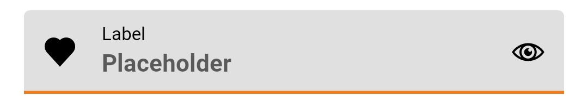
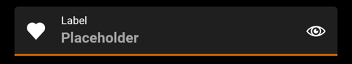
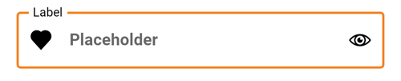
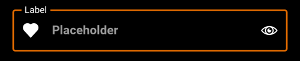

---

**Page Summary**

* [Specifications references](#specifications-references)
* [Accessibility](#accessibility)
* [Variants](#variants)
  * [Filled text field](#filled-text-field)
  * [Filled password text field](#filled-password-text-field)
  * [Outlined text field](#outlined-text-field)
  * [Outlined password text field](#outlined-password-text-field)
* [Extras](#extras)
  * [Character counter](#character-counter)
* [Component specific tokens](#component-specific-tokens)

---

## Specifications references

- [Design System Manager - Text fields](https://system.design.orange.com/0c1af118d/p/483f94-text-fields/b/720e3b)
- [Material Design - Text fields](https://material.io/components/text-fields/)
- Technical documentation soon available

## Accessibility

Please follow [accessibility criteria for development](https://a11y-guidelines.orange.com/en/mobile/android/development/)

Android's text field component APIs support both label text and helper text for informing the user
as to what information is requested for a text field. While optional, their use is strongly
encouraged.

**Content description**

When using **custom icons**, you should set a content description on them so that screen readers
like TalkBack are able to announce their purpose or action, if any.

For the leading icon, that can be achieved via the
`app:startIconContentDescription` attribute or `setStartIconContentDescription`
method. For the trailing icon, that can be achieved via the
`app:endIconContentDescription` attribute or `setEndIconContentDescription`
method.

When setting an **error message** that contains special characters that screen readers or other
accessibility systems are not able to read, you should set a content description via
the `app:errorContentDescription` attribute or
`setErrorContentDescription` method. That way, when the error needs to be announced, it will
announce the content description instead.

**Custom `EditText`**

If you are using a custom `EditText` as `TextInputLayout`'s child and your text field requires
different accessibility support than the one offered by
`TextInputLayout`, you can set a `TextInputLayout.AccessibilityDelegate` via the
`setTextInputAccessibilityDelegate` method. This method should be used in place of providing
an `AccessibilityDelegate` directly on the `EditText`.

## Variants

### Filled text field

Filled text fields have more visual emphasis than outlined text fields, making them stand out when
surrounded by other content and components.

    
  

> **Jetpack Compose implementation**

To add a filled text field in your composable screen you can use the `OdsTextField` composable as follow:

```kotlin
var text by rememberSaveable { mutableStateOf("") }
OdsTextField(
    leadingIcon = painterResource(id = R.drawable.ic_heart), // Optional
    leadingIconContentDescription = "Like", // Optional
    onLeadingIconClick = { doSomething() }, // Optional
    enabled = true, // true if not set
    readOnly = false, // false if not set
    isError = false, // false if not set
    value = text,
    onValueChange = { text = it },
    label = "Label", // Optional
    placeholder = "Placeholder", // Optional
    trailingIcon = painterResource(id = R.drawable.ic_eye), // Optional
    trailingIconContentDescription = "Show password", // Optional
    onTrailingIconClick = { doSomething() }, // Optional
    trailingText = "units", // Optional
    visualTransformation = VisualTransformation.None, // `VisualTransformation.None` if not set
    keyboardOptions = KeyboardOptions.Default, // `KeyboardOptions.Default` if not set
    keyboardActions = KeyboardActions(), // `KeyboardActions()` if not set
    singleLine = false, // false if not set
    maxLines = Int.MAX_VALUE, // `Int.MAX_VALUE` if not set
)
```

> **XML implementation**

_**Note:** The filled text field is the default style if the style is not set._

API and source code:

* `TextInputLayout`: [Class definition](https://developer.android.com/reference/com/google/android/material/textfield/TextInputLayout), [Class source](https://github.com/material-components/material-components-android/tree/master/lib/java/com/google/android/material/textfield/TextInputLayout.java)
* `TextInputEditText`: [Class definition](https://developer.android.com/reference/com/google/android/material/textfield/TextInputEditText), [Class source](https://github.com/material-components/material-components-android/tree/master/lib/java/com/google/android/material/textfield/TextInputEditText.java)

In the layout:

```xml

<com.google.android.material.textfield.TextInputLayout
    android:id="@+id/filledTextField"
    android:layout_width="match_parent"
    android:layout_height="wrap_content"
    android:hint="@string/label">

    <com.google.android.material.textfield.TextInputEditText
        android:layout_width="match_parent"
        android:layout_height="wrap_content" />

</com.google.android.material.textfield.TextInputLayout>
```

In code:

```kotlin
// Get input text
val inputText = filledTextField.editText?.text.toString()

filledTextField.editText?.doOnTextChanged { inputText, _, _, _ ->
    // Respond to input text change
}
```

### Filled password text field

Filled password text field is a filled text field implementation that includes password visual transformation and optional visualisation icon.

    
  

> **Jetpack Compose implementation**

To add a filled password text field in your composable screen you can use the `OdsPasswordTextField` composable as follow:

```kotlin
var text by rememberSaveable { mutableStateOf("") }
OdsPasswordTextField(
    enabled = true, // true if not set
    readOnly = false, // false if not set
    isError = false, // false if not set
    value = text,
    onValueChange = { text = it },
    label = "Label", // Optional
    placeholder = "Placeholder", // Optional
    visualisationIcon = true, // `true` if not set
    keyboardOptions = KeyboardOptions.Default, // `KeyboardOptions.Default` if not set
    keyboardActions = KeyboardActions() // `KeyboardActions()` if not set
)
```

> **XML implementation**

_Not available_


### Outlined text field

Outlined text fields have less visual emphasis than filled text fields. When they appear in places
like forms, where many text fields are placed together, their reduced emphasis helps simplify the
layout.

    
  

> **Jetpack Compose implementation**

To add an outlined text field in your composable screen you can use the `OdsOutlinedTextField` composable as follow:

```kotlin
var text by rememberSaveable { mutableStateOf("") }
OdsOutlinedTextField(
    leadingIcon = painterResource(id = R.drawable.ic_heart), // Optional
    leadingIconContentDescription = "Like", // Optional
    onLeadingIconClick = { doSomething() }, // Optional
    enabled = true, // true if not set
    readOnly = false, // false if not set
    isError = false, // false if not set
    value = text,
    onValueChange = { text = it },
    label = "Label", // Optional
    placeholder = "Placeholder", // Optional
    trailingIcon = painterResource(id = R.drawable.ic_eye), // Optional
    trailingIconContentDescription = "Show password", // Optional
    onTrailingIconClick = { doSomething() }, // Optional
    trailingText = "units", // Optional
    visualTransformation = VisualTransformation.None, // `VisualTransformation.None` if not set
    keyboardOptions = KeyboardOptions.Default, // `KeyboardOptions.Default` if not set
    keyboardActions = KeyboardActions(), // `KeyboardActions()` if not set
    singleLine = false, // false if not set
    maxLines = Int.MAX_VALUE, // `Int.MAX_VALUE` if not set
)
```

> **XML implementation**

API and source code:

* `TextInputLayout`: [Class definition](https://developer.android.com/reference/com/google/android/material/textfield/TextInputLayout), [Class source](https://github.com/material-components/material-components-android/tree/master/lib/java/com/google/android/material/textfield/TextInputLayout.java)
* `TextInputEditText`: [Class definition](https://developer.android.com/reference/com/google/android/material/textfield/TextInputEditText), [Class source](https://github.com/material-components/material-components-android/tree/master/lib/java/com/google/android/material/textfield/TextInputEditText.java)

In the layout:

```xml

<com.google.android.material.textfield.TextInputLayout 
    android:id="@+id/outlinedTextField"
    android:layout_width="match_parent"
    android:layout_height="wrap_content"
    android:hint="@string/label"
    style="@style/Widget.MaterialComponents.TextInputLayout.OutlinedBox">

    <com.google.android.material.textfield.TextInputEditText 
        android:layout_width="match_parent"
        android:layout_height="wrap_content" />

</com.google.android.material.textfield.TextInputLayout>
```

In code:

```kotlin
// Get input text
val inputText = outlinedTextField.editText?.text.toString()

outlinedTextField.editText?.doOnTextChanged { inputText, _, _, _ ->
    // Respond to input text change
}
```

### Outlined password text field

Outlined password text field is an outlined text field implementation that includes password visual transformation and optional visualisation icon.

    
  

> **Jetpack Compose implementation**

To add an outlined password text field in your composable screen you can use the `OdsPasswordOutlinedTextField` composable as follow:

```kotlin
var text by rememberSaveable { mutableStateOf("") }
OdsPasswordOutlinedTextField(
    enabled = true, // true if not set
    readOnly = false, // false if not set
    isError = false, // false if not set
    value = text,
    onValueChange = { text = it },
    label = "Label", // Optional
    placeholder = "Placeholder", // Optional
    visualisationIcon = true, // `true` if not set
    keyboardOptions = KeyboardOptions.Default, // `KeyboardOptions.Default` if not set
    keyboardActions = KeyboardActions() // `KeyboardActions()` if not set
)
```

> **XML implementation**

_Not available_

## Extras

### Character counter

You can add a character counter if there is a restriction on the number of characters in a field. It has to be placed below the text field, end aligned.

    
  

> **Jetpack Compose implementation**

```kotlin
OdsTextFieldCounter(
    modifier = Modifier.align(Alignment.End),
    valueLength = valueLength, 
    maxChars = 20,
    enabled = true // `true` if not set. If `false` the counter is displayed with a disabled color
)
```

The limitation behavior should be managed by yourself in the `onValueChange` method of the text field.

```kotlin
if (text.length <= TextFieldMaxChars) {
    value = text
}
```

## Component specific tokens

_Soon available_
