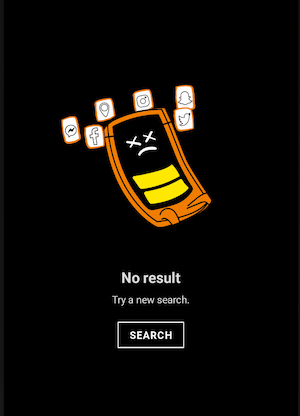

An empty state display should inform the user of what is happening, why it's happening and what to do about it.

<br>**On this page**

* [Specifications references](#specifications-references)
* [Accessibility](#accessibility)
* [Integration](#integration)
    * [Jetpack Compose](#jetpack-compose)
        * [OdsEmptyStateView API](#odsemptystateview-api)

---

## Specifications references

- [Design System Manager - Empty states](https://system.design.orange.com/0c1af118d/p/69b934-empty-states/b/63721e)

## Accessibility

Please follow [accessibility criteria for development](https://a11y-guidelines.orange.com/en/mobile/android/development/).

The ODS Empty states module is built to support accessibility criteria and is readable by most screen readers, such as TalkBack.

## Integration

 

### Jetpack Compose

To integrate an ODS Empty state into your app, you can use `OdsEmptyStateView` composable as shown below:

```kotlin
OdsEmptyStateView(
    title = "No result",
    text = "Try a new search",
    button = OdsEmptyStateView.Button(text = "Search") {
        // Do something
    },
    image = OdsEmptyStateView.Image(painter = painterResource(id = R.drawable.il_no_result))
)
```

#### OdsEmptyStateView API

{:.table}

| Parameter                           | Default&nbsp;value                                                                | Description                                                                       |
|-------------------------------------|-----------------------------------------------------------------------------------|-----------------------------------------------------------------------------------|
| <b>`title: String`</b>              |                                                                                   | The title of the screen displayed below the image. For example "File is missing". |
| `modifier: Modifier`                | `Modifier`                                                                        | `Modifier` applied to the composable                                              |
| `text: String?`                     | `null`                                                                            | Text displayed below the title                                                    |
| `image: OdsEmptyStateView.Image`    | `OdsEmptyStateView.Image(painter = painterResource(id = R.drawable.il_yoga_man))` | Image displayed centered in the composable                                        |
| `button: OdsEmptyStateView.Button?` | `null`                                                                            | The button to add below the text                                                  |
