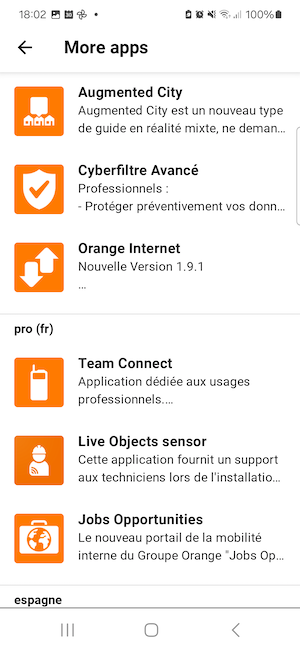
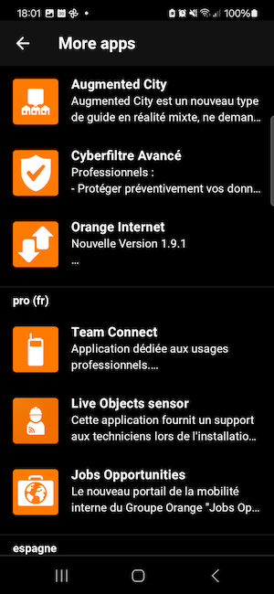

The ODS More apps module queries the Apps+ backend to display other Orange applications to discover.

<br>**On this page**

* Table of contents
{:toc}

---

## Specifications references

- [Design System Manager - More apps](https://system.design.orange.com/0c1af118d/p/91bf01-more-apps)

## Accessibility

Please follow [accessibility criteria for development](https://a11y-guidelines.orange.com/en/mobile/android/development/).

The ODS More apps module is built to support accessibility criteria and is readable by most screen readers, such as TalkBack.

## Integration

**Prerequisites:** Before using the ODS More apps module, you need to create an applications list from the [OMA Apps Plus website](https://admin.appsplus-oma.apps-details.com). Create an account and create you own list from the "App lists" tab. This will create the API key to use in the module configuration.





### Jetpack Compose

Follow these steps in order to integrate the ODS More apps module into your app:

1. Add the ODS More apps module to the `dependencies` section of your `build.gradle` file:

    ```groovy
    dependencies {
        // ...
        implementation 'com.orange.ods.android:ods-module-more-apps:1.0.0'
        // ...
    }
    ```

2. Add ODS More apps graph to your app navigation graph and provide a lambda that returns a configuration for the module (see [Configuration chapter](#configuration)).

    ```kotlin
    NavHost(
        navController = navController,
        startDestination = StartRoute,
        modifier = Modifier.padding(innerPadding)
    ) {
        //...
        odsMoreAppsGraph {
            OdsMoreAppsConfiguration(
                apiKey = BuildConfig.APPS_PLUS_API_KEY,
                filter = "filter"
            )
        }
        //...
    }
    ```

3. Use the `NavController.navigate()` method with `OdsMoreAppsDestinations.MoreAppsRoute` parameter when you need to display the previously configured ODS MoreApps.

   ```kotlin
   navController.navigate(OdsMoreAppsDestinations.MoreAppsRoute)
   ```

## Configuration

In order to configure the ODS More Apps Module, you need to provide an `OdsMoreAppsConfiguration`. The properties of this class are explained below.

### OdsMoreAppsConfiguration API

| Property                | Default&nbsp;value    | Description                                                                                                                                               |
|-------------------------|-----------------------|-----------------------------------------------------------------------------------------------------------------------------------------------------------|
| <b>`apiKey: String`</b> |                       | The Apps Plus API key available on OMA Apps plus portal. <b>Warning: You must never store unencrypted secrets in Git repository for security reasons.</b> |
| `locale: Locale`        | `Locale.getDefault()` | The locale used to retrieve apps list from Apps Plus. The device locale is used by default.                                                               |
| `filter: String?`       | `null`                | The apps in the provided `filter` container will be displayed by the module.                                                                              |
