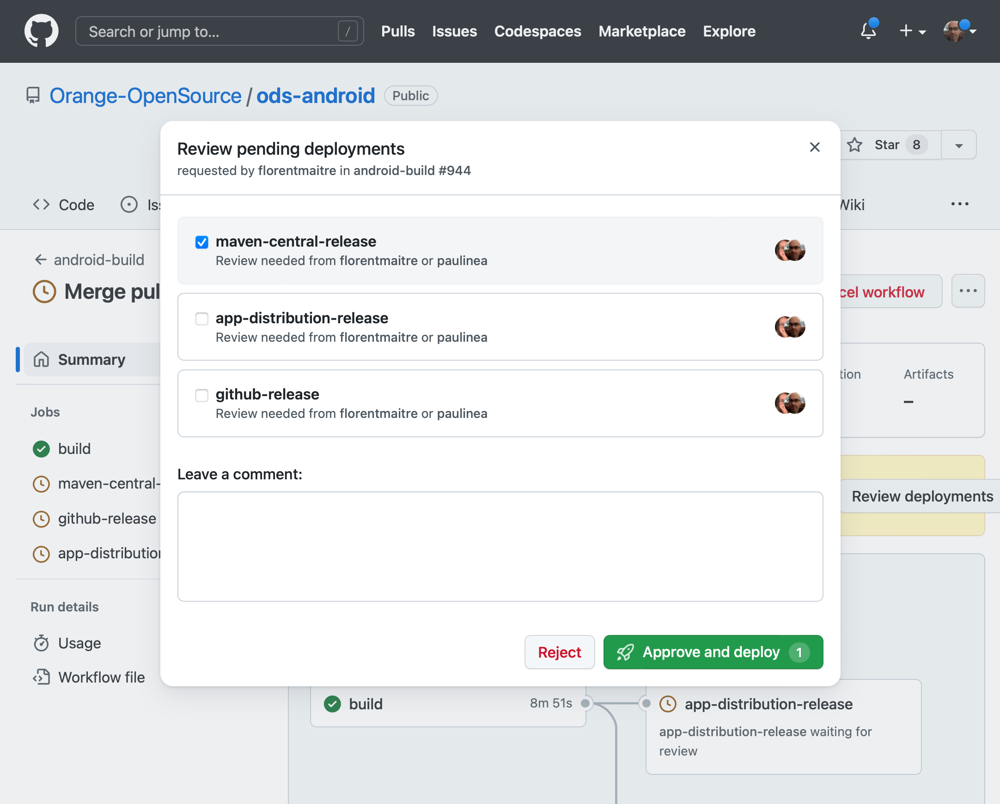
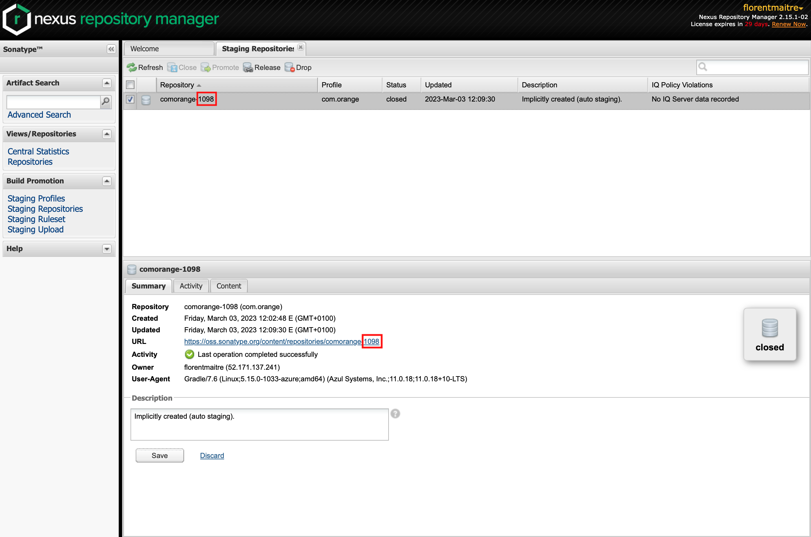
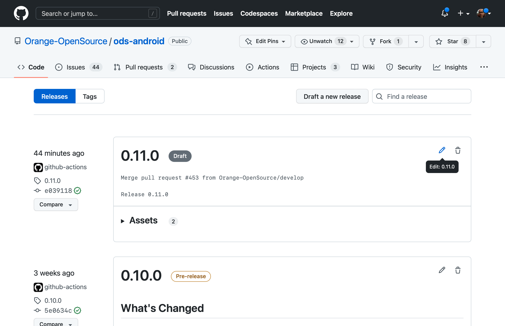
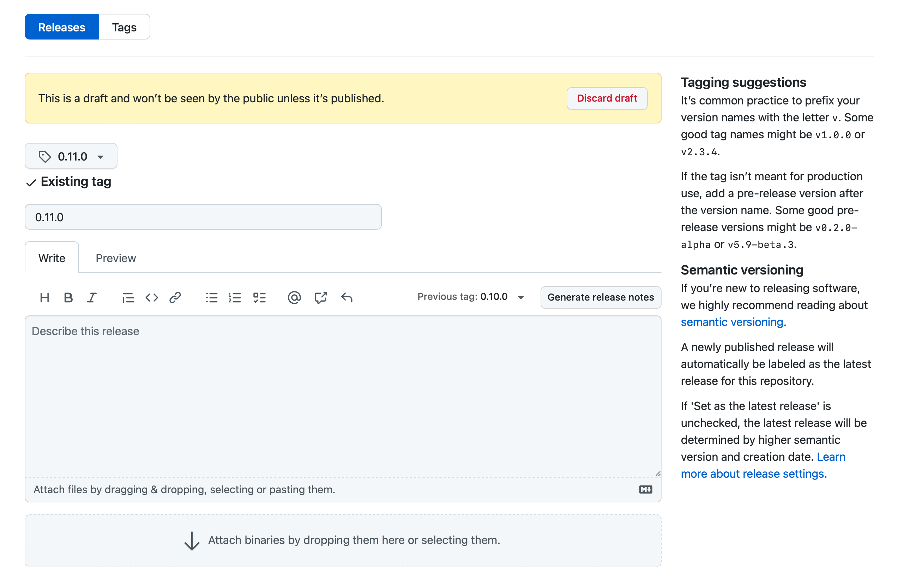
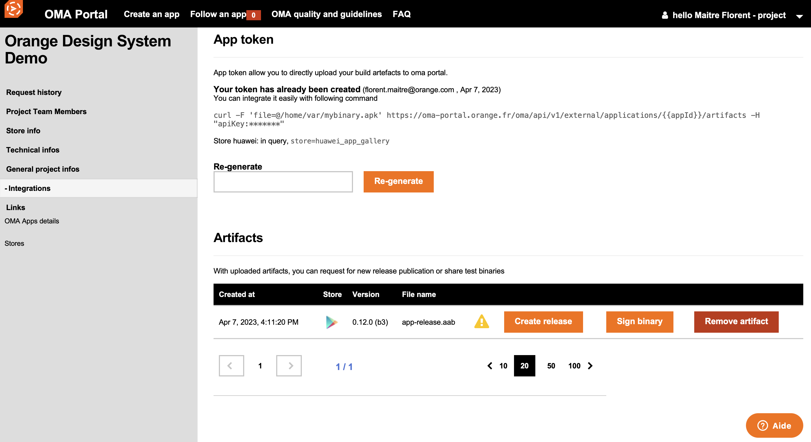
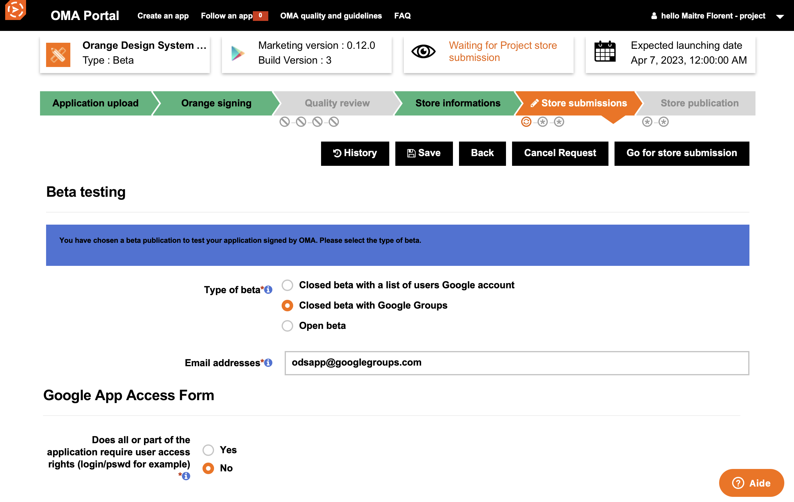

# ODS Android release guide

This file lists all the steps to follow when releasing a new version of ODS Android.

- [Prepare release](#prepare-release)
- [Release](#release)
  * [Publish release to Maven Central](#publish-release-to-maven-central)
  * [Publish release to GitHub](#publish-release-to-github)
  * [Build unsigned APK and bundle for Google Play Store](#build-unsigned-apk-and-bundle-for-google-play-store)
  * [Announce the new release on FoODS](#announce-the-new-release-on-foods)<br /><br />

## Prepare release

- Create a branch named `prepare-release` to prepare the new release for ODS Android version X.Y.Z.

- Switch to this branch and launch the `prepareRelease` Gradle task:

    ```shell
    ./gradlew prepareRelease -Pversion=X.Y.Z
    ```

    This task performs the following changes to the project:
    
    - Update `version` project property in `gradle.properties`.
    - Update version of ODS Android dependencies in various Markdown files.
    - Update the changelog.
    - Archive the documentation in `docs/X.Y.Z`.
    - Update Jekyll configuration files.<br /><br />

- Verify the changes mentioned above, then commit and push.

    Please see [DEVELOP.md](../DEVELOP.md#documentation) to get more information about how to build and verify the documentation.
    
    Once the Jekyll server is started, the documentation for version X.Y.Z should be available at http://127.0.0.1:4000/ods-android/X.Y.Z/.

- Create a new pull request named `Prepare release X.Y.Z` on GitHub to merge your branch into `develop`.

- Review and merge this pull request on GitHub.<br /><br />

## Release

- Create a new pull request named `Release X.Y.Z` on GitHub to merge `develop` into `master`.

- Review and merge this pull request on GitHub.

- Switch to the latest master commit and launch the `tagRelease` Gradle task:

    ```shell
    ./gradlew tagRelease
    ```

    This task adds an `X.Y.Z` tag and push it to the remote repository.<br /><br />

### Publish release to Maven Central

- Go to [GitHub Actions](https://github.com/Orange-OpenSource/ods-android/actions) and open the workflow launched by the tag creation.

- Click `Review deployments`, select `maven-central-release` and click `Approve and deploy`.

    

- Go to [Sonatype Nexus Repository Manager](https://oss.sonatype.org).

- Click `Staging Repositories` and verify the content of the ODS Android repository.

    

- Click `Close` if content is OK or `Drop` otherwise.

- Retrieve the Sonatype repository ID from either the repository name or URL.

    

- Launch the `testSonatypeRepository` Gradle task using the ID from the previous step:

    ```shell
    ./gradlew testSonatypeRepository -PsonatypeRepositoryId=<repository_id>
    ```

    This task allows you to test the release before it is deployed to Maven Central and performs the following changes to the project:
    
    - Add Sonatype Maven repository.
    - Remove all Android Studio modules except `app`.
    - Replace project dependencies with module dependencies in `app`.<br /><br />

- Synchronize Gradle, build app, deploy and test on device.

- Go back to Sonatype Nexus Repository Manager and click `Release`.<br /><br />

### Publish release to GitHub

- Go to [GitHub Actions](https://github.com/Orange-OpenSource/ods-android/actions), open the release workflow, click `Review deployments`, select `github-release` and click `Approve and deploy`.

- Go to [GitHub Releases](https://github.com/Orange-OpenSource/ods-android/releases).

- Edit the new release draft.

    

- Set previous tag and click `Generate release notes` to automatically generate the release notes.

    

- Verify the release notes using the preview tab.

- Optionally check `Set as a pre-release` and click `Publish release`.<br /><br />

### Publish release to Google Play Store

- Go to [GitHub Actions](https://github.com/Orange-OpenSource/ods-android/actions), open the release workflow, click `Review deployments`, select `google-play-store-release` and click `Approve and deploy`.

- Go to [OMA Portal](https://oma-portal.orange.fr) and open the `Orange Design System Demo` dashboard.

- Click `Integrations`, find the uploaded bundle in the `Artifacts` sections and click `Create release`.

     

- Progress through the various submission steps.

- When step is `Store submissions`, select `Closed beta with Google Groups`, set `Email addresses` to `odsapp@googlegroups.com` and click `Go to store submission`.

    <br /><br />

### Announce the new release on FoODS

- Go to [Teams - FoODS: ODS Mobile Android](https://teams.microsoft.com/l/channel/19%3a62efff7aca9f4865a841076b4a6c428f%40thread.tacv2/4-ODS%2520Mobile%2520Android?groupId=a9581e9e-6775-46f5-9e4a-3ce57096e6be&tenantId=90c7a20a-f34b-40bf-bc48-b9253b6f5d20)

- Post a message with screenshots of new elements to announce the release.

    As Microsoft Teams does not support pasting Markdown, open the text below in a Markdown editor that produces rich text, copy the rich text and paste it to Microsoft Teams. Finally edit the message to display the emojis and add newlines wherever needed.


    > (rocket) Release X.Y.Z is available!
    >
    > **New components**
    >- C8
    >- C9
    >
    >**New module**
    >- M1
    >
    >(page) [Release note](https://github.com/Orange-OpenSource/ods-android/releases/tag/X.Y.Z)
    >
    >(phone) [Demo app](https://play.google.com/apps/testing/com.orange.ods.app)
    >
    >Note: Please subscribe to the [Orange Design System Google group](https://groups.google.com/g/odsapp) in order to be able to install the demo app.
